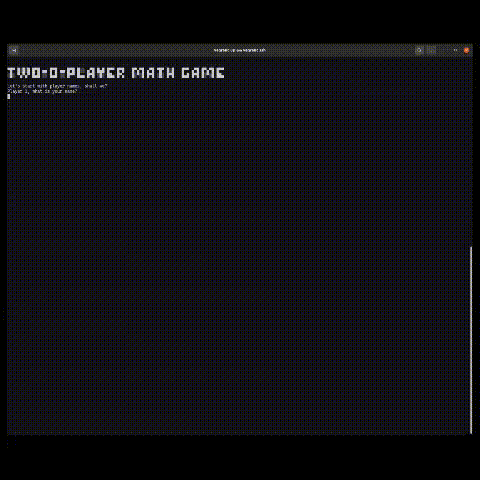

# TwO-O-Player Math Game
A 2-Player math game where players take turns to answer simple math addition problems.
A new math question is generated for each turn by picking two numbers between 1 and 20.

<kbd></kbd>

## Rules
Each player starts with 3 lives.
The player whose turn it is is prompted the question and must answer correctly or lose a life.
The game doesn’t end until one of the players loses all their lives.

If you think you are mentally prepared.. What are you waiting for? 
### Tips: 
- Take deep breaths to calm yourself
- Stay hydrated.